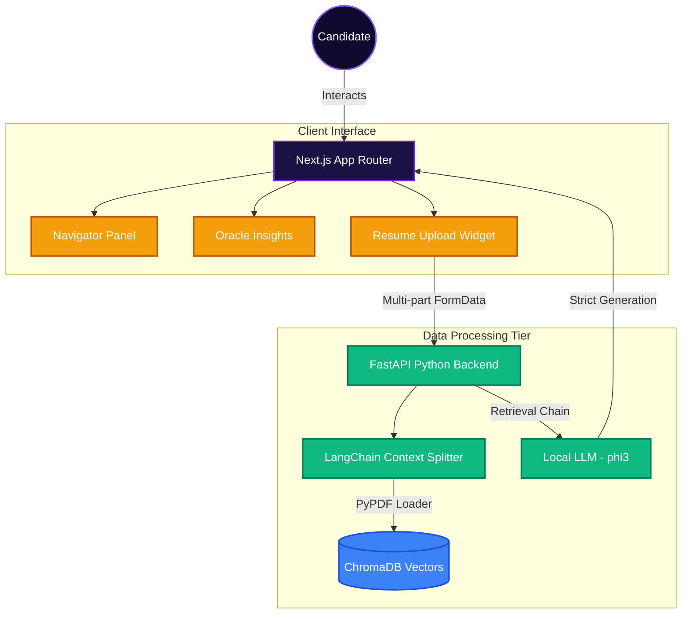
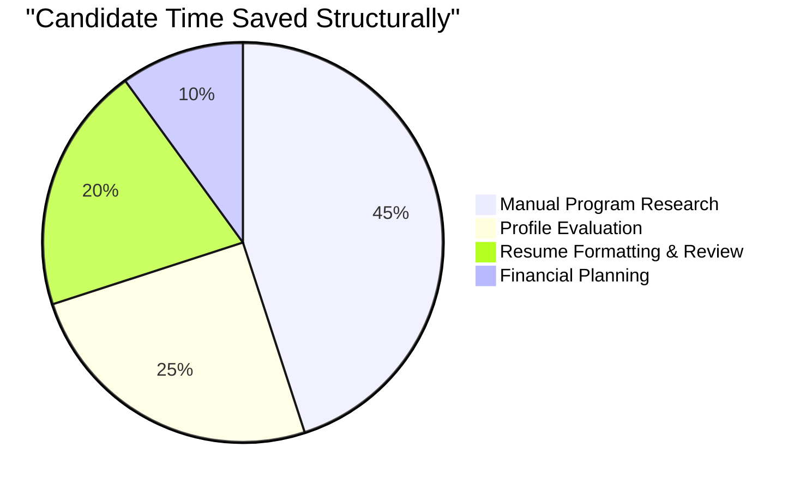

<div align="center">
  
  <h1>🚀 StudyLaunch</h1>
  <p><strong>The Next-Generation SaaS Platform for Autonomous Institutional Matching & Resume Parsing</strong></p>
</div>

<br />

<div align="center">

[](#)
[](#)
[](#)
[](#)

</div>

---

## 🌟 Overview

StudyLaunch isn't just an application—it's a comprehensive **AI-driven SaaS ecosystem** tailored for elite candidates navigating top-tier university admissions and funding. With state-of-the-art **Retrieval-Augmented Generation (RAG)** capabilities, hyper-personalized matching algorithms, and enterprise-grade UI components, it eliminates the guesswork out of the application journey.

### Why StudyLaunch?
1. **Unparalleled UI/UX:** Built meticulously with a modern *neon glassmorphism* aesthetic, delivering a premium, immersive client experience.
2. **Deterministic LLM Resourcing:** We enforce hallucination-free querying over candidate resumes.
3. **Deep Integrations:** Next.js Server Components working symbiotically with lightweight local Python endpoints.

---

## 💎 Core SaaS Modules

An architectural symphony orchestrating these four independent engines:

### 🧭 Navigator
Bespoke academic profiling. Match against 12,000+ elite programs based on budget constraints, GPA, and work experience. Delivers localized ROI estimations through granular visualizations.

### 🔮 Oracle
Predictive Admission algorithms. Predict your exact admit probability leveraging statistical overlays and historic data modeling.

### 💰 LoanSense
Embedded financial analytics. Get precise tuition coverage models with real-time conversion structures, seamlessly tied with our financial partners.

### 📄 Contextual Resume Engine (Strict Q&A)
An offline, local-embedded NLP architecture.
Our dual-model approach ingests PDFs, parses complex semantic relations into `ChromaDB` dense vectors, and provides a strict Question-&-Answer bot utilizing `phi3` models without any network latencies or hallucinations.

---

## 📊 System Architecture Infographic

Below is an abstract representation of the scalable multi-node pipeline:



---

## 📈 Platform Metrics & Value (ROI)



---

## ⚙️ Installation & Usage

### 0. Prerequisites
- **Node.js** `v18+` environment over `pnpm` or `npm`.
- **Python** `3.9+` enabled securely.
- **Ollama** running locally with the `phi3` model downloaded (`ollama pull phi3`).

### 1. Unified Launch Strategy
Deploy the entire enterprise stack with one command, leveraging explicit concurrency protocols.

```bash
# Clone Repository
git clone https://github.com/your-username/StudyLaunch.git
cd StudyLaunch

# Install Dependencies
npm install
cd backend && pip install -r requirements.txt && cd ..

# Launch Ecosystem
npm run dev
```

* `http://localhost:3000` - Next.js Operations Panel
* `http://localhost:8000` - FastAPI Microservice Engine

---

<div align="center">
  <i>Engineered for the absolute pinnacle of technological orchestration. Built locally, scaled globally.</i>
</div>
