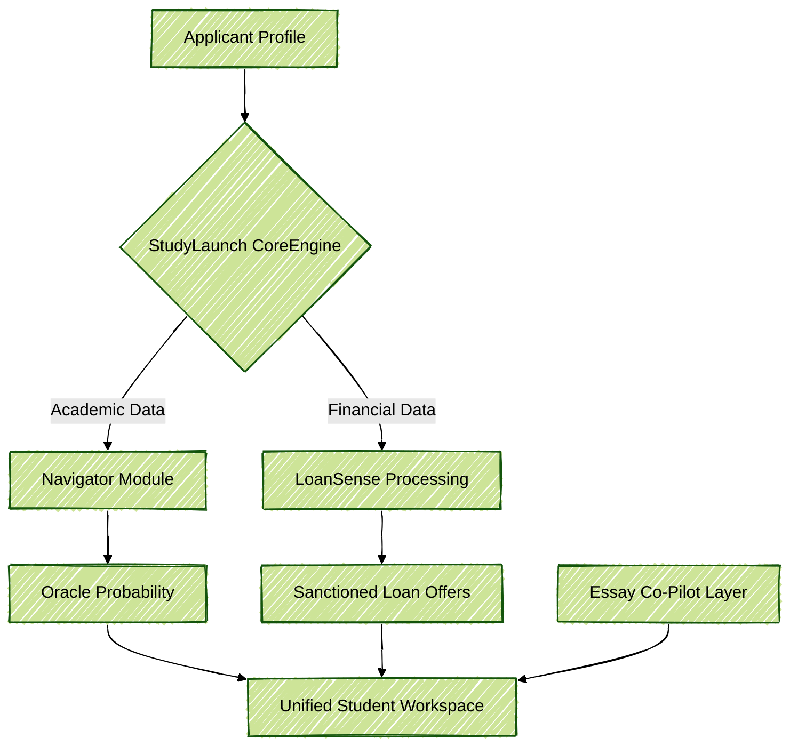
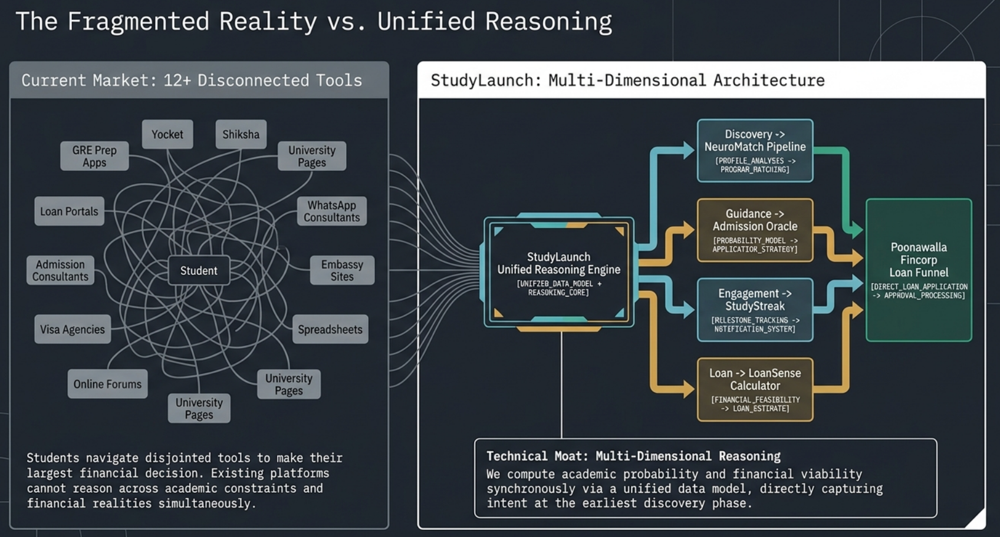
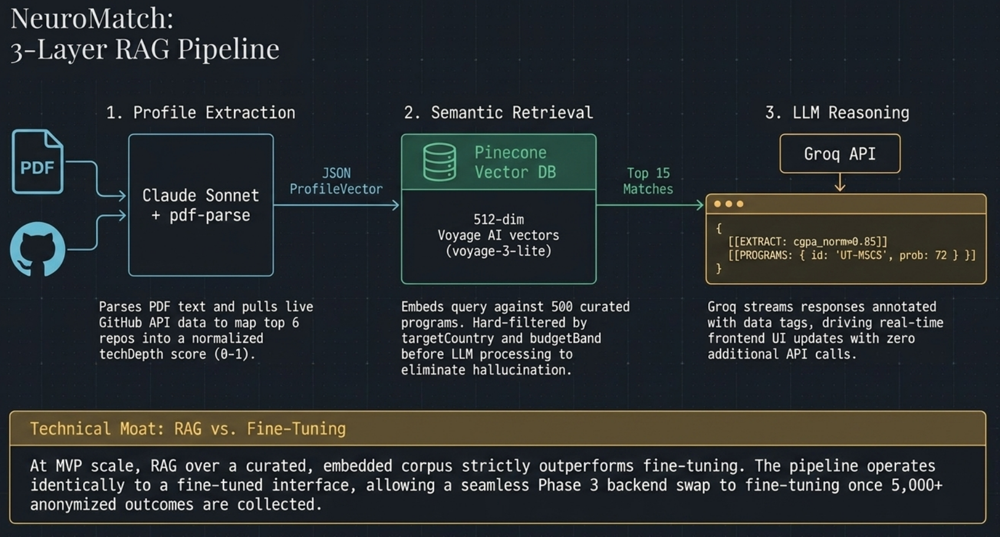
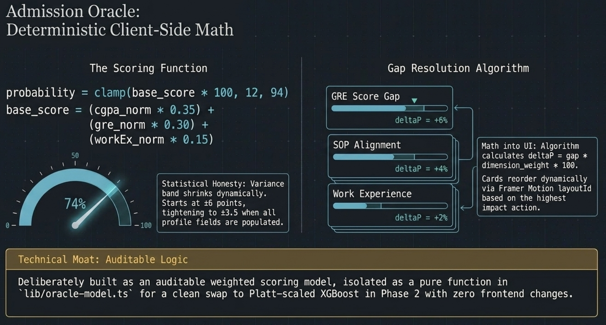

# StudyLaunch

**The Next-Generation SaaS Platform for Elite University Admissions**

## Overview

StudyLaunch is an enterprise-grade ecosystem tailored for candidates navigating top-tier university admissions and funding. Built with Next.js App Router, the platform provides hyper-personalized matching, probabilistic admission scoring, and precise educational financing models, delivering a deterministic processing experience.

## Features & Modules

- **Navigator (Discovery):** AI-matched shortlist tuned to profile, budget, and goals.
- **Oracle (Probability):** Real-time admit probability with explainable factors and transparency.
- **LoanSense (Financing):** Co-signer-free loan options, EMI modeling, and DLG-ready offers.
- **Dashboard (Command):** Application tracking, deadline management, and secure document vault.
- **Essay Co-Pilot (Craft):** Statement of purpose drafting environment that preserves the applicant's unique voice.

## Architecture & Data Flow

### Conceptual DFD

Below is the conceptual Data Flow Diagram representing the core mechanisms of StudyLaunch.



### System Workflows

*Data Flow Diagrams detailing user interactions and algorithmic pipelines.*






## Documentation

- **Product Requirements Document (PRD):** Comprehensive specifications outlining feature sets, compliance standards (RBI & DPDP), and the deterministic modeling approaches used in our core AI engines.
- **Prototype Guides:** Live prototype documentation detailing the implementation of UI transitions, component orchestration, and native browser optimizations for the frontend architecture.

## Quick Setup Guide

### Prerequisites
- Node.js v18+ environment
- Package manager (npm or pnpm)

### Installation & Launch

1. Clone the repository:
   ```bash
   git clone https://github.com/your-username/StudyLaunch.git
   cd StudyLaunch
   ```

2. Install development dependencies:
   ```bash
   npm install
   ```

3. Launch the operational workspace:
   ```bash
   npm run dev
   ```

The dashboard and primary interfaces will be active at `http://localhost:3000`.

## Team

StudyLaunch is actively maintained and built by our core engineering group.

| Anshuman Pathak | Gaurav Shahi | Deepanshu Dwivedi |
| :---: | :---: | :---: |
|  |  |  |
| Lead Frontend / Gen-AI | Full-Stack / Platform & API | SaaS Growth / Machine Learning |

*Engineered for the absolute pinnacle of technological orchestration. Built locally, scaled globally.*
