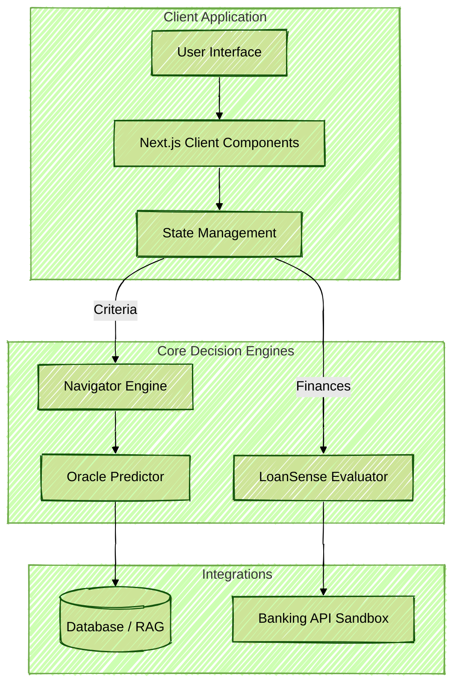
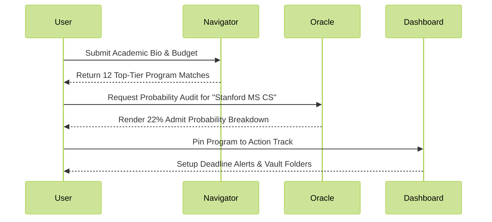

# StudyLaunch

**The Next-Generation SaaS Platform for Elite University Admissions**

## Overview

StudyLaunch is an enterprise-grade ecosystem tailored for candidates navigating top-tier university admissions and funding. Built with Next.js App Router, the platform provides hyper-personalized matching, probabilistic admission scoring, and precise educational financing models, delivering a deterministic processing experience entirely within the browser. 

This platform acts as an automated consultant that eliminates the guesswork traditionally associated with applications to prestigious institutions such as Ivy League universities, Oxbridge, and other top global universities.

## System Architecture

The fundamental architecture of StudyLaunch operates as a composable monolithic structure encompassing state manipulation, probability calculation, and data-driven recommendations.



## Features & Modules

### 1. Navigator (Discovery)
The Navigator serves as the main entry point to the system. It leverages a vast proprietary database to algorithmically match students against 12,000+ elite global programs.
- **Parametric Filtering:** Tuned to handle constraints across budget, standardized test scores (GRE/GMAT/IELTS), and strict geographical requirements.
- **Dynamic Program Shortlisting:** Adjusts real-time with visual updates prioritizing highest ROI paths.

### 2. Oracle (Probability)
Oracle replaces human intuition with statistical rigor. It provides a real-time admit probability based on algorithmic evaluation logic.
- **Explainable Analytics:** Oracle explains *why* a candidate has an 87% chance for Cornell but a 54% chance for Stanford.
- **Factor Grading:** Assesses profile weight logic, grading undergraduate university rigor, work experience duration, and GPA scaling.

### 3. LoanSense (Financing)
LoanSense acts as an embedded financial partner modeling viable tuition coverage mechanisms for candidates.
- **Co-Signer-Free Workflows:** Identifies loan products applicable to international students without a local cosigner.
- **Amortization & EMI Modeling:** Calculates long-term ROI depending on expected post-graduate salaries versus compound loan interest.

### 4. Dashboard (Command Center)
A robust command system that encapsulates the entire procedural workflow of submitting the actual applications.
- **Application Tracking:** Deadline tracking down to the exact timezone to prevent fatal application delays.
- **Secure Vault:** A single repository handling transcripts, LoRs, and application proofs.

### 5. Essay Co-Pilot (Craft)
An AI-assisted drafting environment strictly designed against narrative homogenization.
- **Voice Preservation:** Models the candidate's stylistic tendencies prior to generating or rewriting segments of intent statements.
- **Structure Pre-Validation:** Ensures the Statement of Purpose aligns with the specific prompt parameters issued by the targeted institution.

## System Workflows

*Data Flow Diagrams detailing user interactions and algorithmic pipelines.*


## Documentation

- **Product Requirements Document (PRD):** Comprehensive specifications outlining feature sets, compliance standards (RBI & DPDP), and the deterministic modeling approaches used in our core AI engines.
- **Prototype Guides:** Live prototype documentation detailing the implementation of UI transitions, component orchestration, and native browser optimizations for the frontend architecture. 

### User Flow Journey



## Quick Setup Guide

### Prerequisites
- Node.js v18+ environment
- Package manager (npm or pnpm)

### Installation & Launch

1. Clone the repository:
   ```bash
   git clone https://github.com/RudeHats/StudyLaunch.git
   cd StudyLaunch
   ```

2. Install development dependencies:
   ```bash
   npm install
   ```

3. Launch the operational workspace:
   ```bash
   npm run dev
   ```

The dashboard and primary interfaces will be active at `http://localhost:3000`.

## Team

StudyLaunch is actively maintained and built by our core engineering group.

| Anshuman Pathak | Gaurav Shahi | Deepanshu Dwivedi |
| :---: | :---: | :---: |
|  |  |  |
| Lead Frontend / Gen-AI | Full-Stack / Platform & API | SaaS Growth / Machine Learning |

*Engineered for the absolute pinnacle of technological orchestration. Built locally, scaled globally.*
